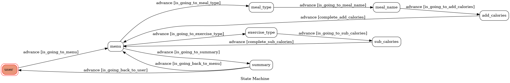

# CalCal - Calories Calculator
[toc]
## Introduction


這個LineBot可以很方便的利用Line來追蹤一天四餐(包括宵夜)的熱量攝取，以及運動所額外消耗的熱量

## Feature
- 條列式方便查看每餐吃了什麼，熱量多少
- 計算熱量的收支，配合基礎代謝率可得知淨攝取的熱量
- (Future)加入條碼掃描整合超商的條碼資料庫，自動輸入熱量與營養素計算

## prerequisite
- Ubuntu 20.04
- python 3.8
- Your line account

### Install Dependency
```=bash
pip3 install line-bot-sdk flask gunicorn \
transition graphviz pygraphviz -y
```

### Secre Data
將在Line bot網頁中產生的`LINE_CHANNEL_SECRET`和`LINE_CHANNEL_ACCESS_TOKEN`放入`.env`中

### Run Locally with ngrok
- [ngrok Download(linux)](https://ngrok.com/download)

You will get a executable file after unziping. Run it with the following command
```=bash
./ngrok config add-authtoken <token>
./ngrok http <port>
```

then, run the server
```=bash
python3 app.py
```

## Finite State Machine


## Reference
- [TOC-Project-2020](https://github.com/NCKU-CCS/TOC-Project-2020)
- [Line-bot-sdk-python](https://github.com/line/line-bot-sdk-python/tree/master/examples/flask-echo)